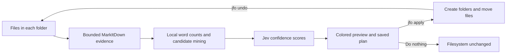

# JFO — intelligent file organization, with an undo button

JFO is a preview-first command-line organizer powered by [Jev](https://typesafe.ai/) and [Microsoft MarkItDown](https://github.com/microsoft/markitdown). Run it inside a messy folder, review a color-coded plan, and apply only the moves that clear your confidence threshold.

It can use folders you already have or propose new ones from repeated filenames, file types, document vocabulary, and your own rules. Every applied plan can be undone.

> **Pre-release:** JFO is being prepared for its first public release. The package name and installation flow are implemented but not yet published to PyPI.

> **Docker is not required.** End users install JFO as an isolated command-line tool. Docker is used only for reproducible development and CI.

**[Read the complete usage guide](USAGE.md)** · [Roadmap](ROADMAP.md) · [Apache 2.0 license](LICENSE)

## Why JFO

- **Preview first.** Running `jfo` does not move files.
- **Confidence gated.** No move can occur below `0.70`; you can raise the threshold.
- **Reversible.** Plans are fingerprinted, validated before application, and undoable.
- **Transparent folder discovery.** `jfo candidates` shows every candidate name and exactly where it came from—without calling Jev.
- **Content aware.** MarkItDown extracts bounded evidence from PDFs, Office files, HTML, CSV, JSON, images, audio, archives, and other supported formats.
- **Safe fallback.** Unsupported or failed conversions use only the filename.
- **Context aware.** Optional `.jfo.toml` files add descriptions, rules, and candidate names at any level of the tree.

## How it works



JFO walks the tree recursively and simulates every approved hop before changing anything. A file can therefore receive a complete destination such as `Finance/Taxes/2026` in one plan, with every parent-to-child decision clearing the confidence threshold. Existing nested folders can form multi-hop routes; a newly proposed folder is always a leaf for that plan, preventing unbounded generated hierarchies.

## Quick start

JFO requires Python 3.12 or 3.13. Once the package is published, the recommended installation will be:

```bash
uv tool install --python 3.13 jev-file-organizer
```

For the current source checkout:

```bash
./scripts/install.sh .
```

Configure your TypeSafe API key using a hidden prompt, then verify the installation:

```bash
jfo configure
jfo doctor
```

Now organize any folder:

```bash
cd ~/Downloads
jfo
```

The [usage guide](USAGE.md) covers installation, folder selection, previews, applying and undoing plans, configuration, caching, evaluation, and troubleshooting.

Or provide the root-level destinations directly:

```bash
jfo -f "Finance, Travel, Medical"
```

The supplied names become the root destination allowlist for that plan. Existing matching
folders are reused, missing folders are proposed, and unsupported folders are not created.
Repeat `-f` instead of using commas when that reads better.

The command prints proposed folders, confidence scores, candidate sources, every suggested move, and a plan ID. Nothing has moved yet.

```bash
jfo apply <plan-id>  # Apply exactly what was previewed
jfo undo             # Restore the latest applied plan
```

For a one-command preview and apply:

```bash
jfo --apply
```

Preview-first use is recommended until you know how JFO behaves on your files.

## Where folder names come from

JFO generates a bounded set of candidate names locally, then asks Jev whether each candidate is a coherent category for multiple files. Inspect the complete pre-Jev list with:

```bash
jfo candidates
```

Example:

```text
Candidate             Source
Screenshots           repeated in 3 filenames
Software Installers   2 .dmg
Archives              1 .tar.gz, 1 .zip
Finance               corpus term 'payment' appears in 4 files
```

Candidates can come from:

- repeated words and phrases in filenames;
- supported file-type groups;
- words appearing across multiple extracted documents;
- candidate names explicitly supplied in `.jfo.toml`.

A candidate is not automatically created. Jev must approve the category, enough files must independently clear the placement threshold, and you must apply the saved plan.

## Useful commands

```bash
jfo                              # Preview recursive organization
jfo candidates                   # Explain local candidates; no Jev request
jfo apply <plan-id>              # Apply a saved, validated plan
jfo undo                         # Undo the latest applied plan
jfo doctor                       # Check runtime, key, FFmpeg, and folder access
jfo init --recursive             # Add optional config templates
jfo --existing-folders-only      # Never propose new folders
jfo --threshold 0.85             # Demand higher placement confidence
jfo --path /another/folder       # Organize without changing directory
jfo --help                       # Show every option
```

Important controls:

| Option | Purpose |
| --- | --- |
| `--threshold FLOAT` | Placement threshold from `0.70` to `1.00` |
| `--folders TEXT`, `-f TEXT` | Root destination names, comma-separated or repeated |
| `--max-pages N` | Retain at most N detected page or slide sections |
| `--max-chars N` | Cap retained text per file |
| `--max-new-folders N` | Limit proposed folders per parent |
| `--min-folder-files N` | Require N qualifying assignments before creating a folder |
| `--cache / --no-cache` | Enable or disable the local extraction cache |
| `--refresh-cache` | Re-extract files and replace cached evidence |
| `--collision skip\|rename` | Handle an occupied destination name |
| `--verbose` | Show extraction and Jev request diagnostics |

## Add your own organization rules

Create configuration templates:

```bash
jfo init
jfo init --recursive
```

Edit `.jfo.toml` in any folder:

```toml
description = "Incoming household and business documents"
context = "Prefer a small number of durable categories over narrow topics."
rules = [
  "Keep tax documents separate from ordinary receipts.",
  "Travel bookings stay together.",
]

[discovery]
candidate_names = ["Finance", "Travel", "Medical"]
```

Context and rules inherit from ancestor folders. A child folder can add more specific guidance without repeating the parent configuration.

## Safety and privacy

JFO changes files only after an explicit apply operation. A saved plan contains source fingerprints, approved folders, destinations, confidence values, and Jev request IDs. Before moving anything, JFO verifies that every source and destination still matches the preview. Unexpected apply failures trigger rollback.

Undo is refused if a moved file changed or its original path is occupied. JFO is not a backup; important data should still be backed up independently.

To classify files, JFO sends Jev:

- filenames and bounded extracted text samples;
- corpus word and document-frequency counts;
- candidate folder names and their local source evidence;
- applicable descriptions, context, and rules.

The TypeSafe API key is stored in the operating system's user configuration directory with user-only permissions. You may instead provide `TYPESAFE_API_KEY` through the environment. Do not commit `.env` files.

Credential files such as `.env`, private keys, and certificate bundles are excluded by default. Add project-specific rules to the root `.jfo.toml`:

```toml
[privacy]
exclude = ["private/**", "**/secrets/**"]
redact = ["(?i)customer-[0-9]+", "[A-Za-z0-9._%+-]+@example\\.com"]
```

Run `jfo payloads . --include-hidden` to inspect the redacted evidence and context that may be sent to Jev; this command makes no Jev request. `jfo cache inspect .` summarizes local caches without displaying their contents, and `jfo cache clear .` removes only regenerable cache files.

Redaction happens before extracted evidence is written to `.jfo-cache.json` and again at the final Jev request boundary. Plans live under `.jfo/plans/`; they contain filenames and routing metadata but not extracted document text. Both caches and plans are ignored by the supplied `.gitignore`.

## Extraction behavior

MarkItDown is installed with all supported format extras. JFO retains only the configured first page-marked sections when page or slide boundaries survive conversion, and always enforces the character limit.

MarkItDown 0.1.7 does not expose a stop-after-N-pages conversion API, so the initial conversion may still process the complete document. The local cache prevents repeat conversion when filename, size, modification time, and extraction settings are unchanged.

## Measure performance

JFO includes labeled evaluation support for accuracy, move precision and recall, coverage, abstention rate, and end-to-end latency:

```bash
poetry run python scripts/generate_sample.py
poetry run jfo evaluate sample-folder \
  --manifest sample-manifest.json \
  --report evaluation-report.json
```

Pin `--model` when comparing formal evaluation runs.

## Development

Development is reproducible through Docker:

```bash
cp .env.example .env
docker compose build
docker compose run --rm --entrypoint sh jfo -lc \
  "poetry install --with dev && poetry run ruff check . && poetry run pytest"
```

Run against another folder without installing locally:

```bash
JFO_TARGET=/absolute/path docker compose run --rm jfo
```

The project supports Python 3.12 and 3.13. See `ROADMAP.md` for correction learning, richer explanations, scale controls, and public distribution work.

## Public release status

Before the first public release, the project still needs:

- community and security-reporting policies;
- continuous integration on macOS and Linux;
- a GitHub-to-PyPI Trusted Publisher and protected release environment;
- a TestPyPI rehearsal followed by the first signed GitHub release.

Bug reports and contributions will open after the public repository and contribution policy are in place.

## License

JFO is available under the [Apache License 2.0](LICENSE).
